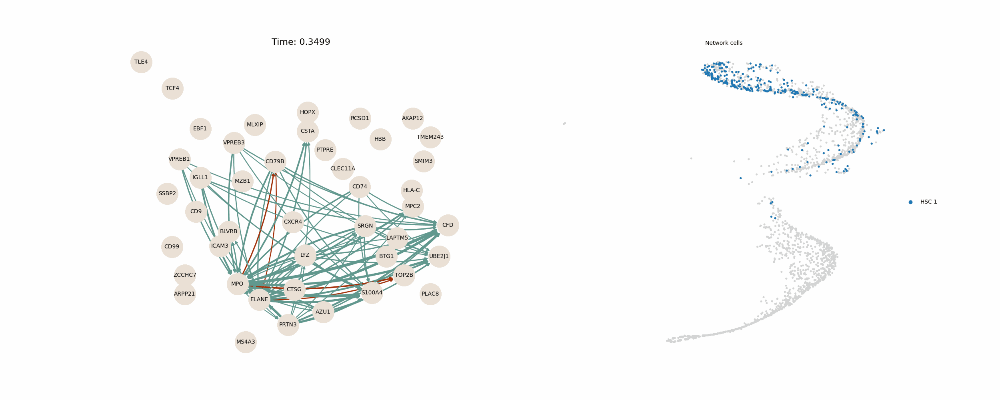
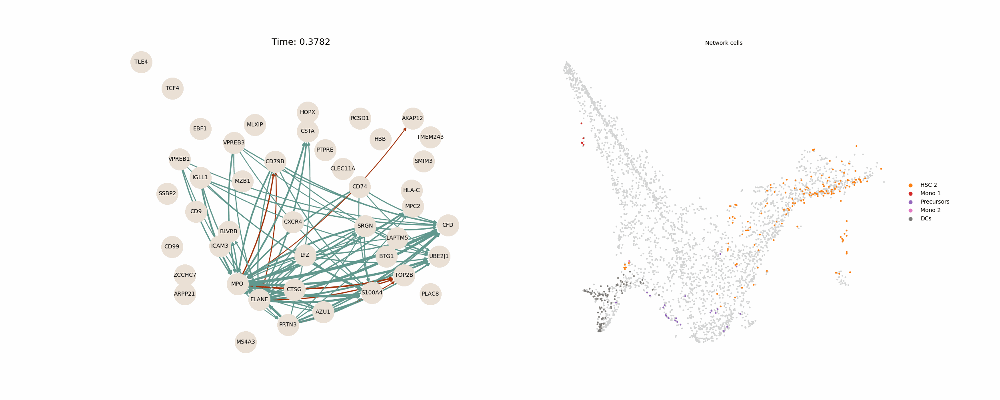

# NeuroVelo: interpretable learning of cellular dynamics
NeuroVelo: physics-based interpretable learning of cellular dynamics. It is implemented on Python3 and PyTorch, the model estimate velocity field and genes that drives the splicing dynamics.


The main contributions of NeuroVelo are,

- Using linear projection and embedding for spliced and unspliced RNA to keep interpretability.
- Introducing sample specific velocity estimation, and sample specific interpretation of cellular dynamics.
- Presenting a loss function based on splicing dynamics.

## Installation

```python3
pip install neurovelo
```

or

```python3
pip install git+https://github.com/idriskb/NeuroVelo
```

To avoid potential conflict, it is advised to create a seperate virtual envrionment to run the method
## Getting started

1. Import package

```python3
from neurovelo.train import Trainer
from neurovelo.utils import ModelAnalyzer, latent_data, evaluate, decode_gene_velocity
```

1. Training

```python3
model = Trainer(adata, sample_obs='sample')
mode.train()
model.save_model('/to/folder/','trained.pth')
```

2. Visualization
You can visualize both velocity in latent space or velocity in gene space

To visualize velocity in latent space, just use ```latent_data``` function then the usual visualization pipeline from ```ScVelo```
```python3
latent_adata = latent_data(adata, '/to/folder/trained.pth')
scv.pp.neighbors(latent_adata, use_rep='X_z', n_neighbors=20)
scv.tl.velocity_graph(latent_adata, vkey='spliced_velocity', xkey='spliced')
scv.tl.velocity_embedding(latent_adata, vkey='spliced_velocity', basis='umap')
scv.pl.velocity_embedding_stream(latent_adata,basis='umap',vkey='spliced_velocity', color='sample')
```

To visualize velocity in gene space, just use ```decode_gene_velocity``` function then the usual visualization pipeline from ```ScVelo```
```python3
adata.layers['spliced_velocity'] = decode_gene_velocity(adata, '/to/folder/trained.pth', layer='spliced')
scv.tl.velocity_graph(adata, vkey='spliced_velocity', xkey='spliced')
scv.tl.velocity_embedding(adata, vkey='spliced_velocity', basis='umap')
scv.pl.velocity_embedding_stream(adata,basis='umap',vkey='spliced_velocity', color='sample')
```

3. Analysis

	1. Gene ranking

		```python3
		analyzer = ModelAnalyzer(adata, n_vectors=20, '/path/to/trained_models/')
		results = analyzer.models_output()
		gene_ranking_order, gene_ranking_mean = analyzer.gene_ranking()
		```
		```gene_ranking_mean``` can be directly used with prerank gene set enrichment analysis
	
	2. Gene network
		```python3
		genes_of_interest = gene_ranking_order['no_treatment'][0][:15].values  # List of genes you're interested in

		# Call the graph_maker method
		A, gi, g, mean_ptime, sorted_cell_value, cell_of_ptime = graph_maker.graph_maker(
			genes_of_interest,
		)
		# Step 3: Create the graph
		threshold_a = 0.05  # Threshold for significant connections
		G = graph_maker.create_graph(A, gi, g, threshold_a)
		# Step 4: Plot the graph
		graph_maker.plot_custom_graph(G,edge_width=20)
		```
		The output is a gene interaction network indeacting how a gene affect the expression of another gene, the package will be extended to make this animated networks for 2 different branches in the differentation of human bone marrow
		
		
### For further and detailed instructions check the notebooks

# Citation
If you find this work useful please cite:
```
@article {Idris2023.11.17.567500,
	author = {Kouadri Boudjelthia, Idris and Milite, Salvatore and El Kazwini, Nour and Huang, Yuanhua and Sottoriva, Andrea and Sanguinetti, Guido},
	title = {NeuroVelo: interpretable learning of cellular dynamics from single-cell transcriptomic data},
	elocation-id = {2023.11.17.567500},
	year = {2024},
	doi = {10.1101/2023.11.17.567500},
	publisher = {Cold Spring Harbor Laboratory},
	abstract = {Reconstructing temporal cellular dynamics from static single-cell transcriptomics remains a major challenge. Methods based on RNA velocity are useful, but interpreting their results to learn new biology remains difficult, and their predictive power is limited. Here we propose NeuroVelo, a method that couples learning of an optimal linear projection with non-linear Neural Ordinary Differential Equations. Unlike current methods, it uses dynamical systems theory to model biological processes over time, hence NeuroVelo can identify what genes and mechanisms drive the temporal cellular dynamics. We benchmark NeuroVelo against several state-of-the-art methods using single-cell datasets, demonstrating that NeuroVelo has high predictive power but is superior to competing methods in identifying the mechanisms that drive cellular dynamics over time. We also show how we can use this method to infer gene regulatory networks that drive cell fate directly from the data. NeuroVelo is available at: https://github.com/idriskb/NeuroVelo},
	URL = {https://www.biorxiv.org/content/early/2024/06/10/2023.11.17.567500},
	eprint = {https://www.biorxiv.org/content/early/2024/06/10/2023.11.17.567500.full.pdf},
	journal = {bioRxiv}
}
```
